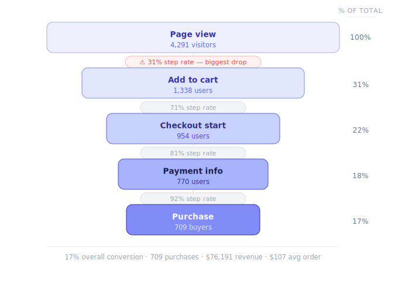
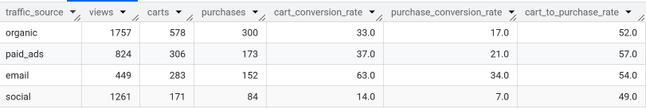
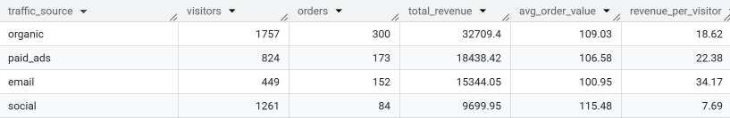
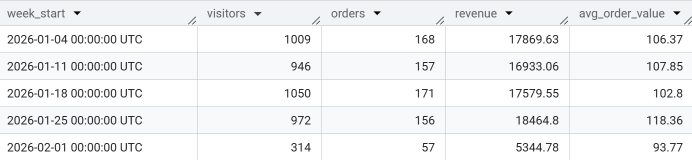
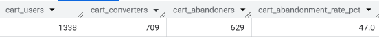

# 🛒 E-commerce Sales Funnel Analysis Project

## Business Problem
 An e-commerce store had no visibility into where users were dropping off across its purchase funnel, making it impossible to prioritise product or marketing improvements.

## Project Overview
  
This project analyzes user behavior data to understand how customers move through different stages of a sales funnel - from product view to purchase.
Using **event-level transactional data**, the project identifies conversion rates, drop-off points, and revenue insights to support data-driven business decisions.

The goal of this project is to:
* Understand customer journey behavior
* Measure stage-wise conversion rates
* Identify drop-off points in the funnel
* Generate actionable business insights

What's Covered
- Funnel stage volumes & conversion rates
- Drop-off analysis
- Traffic source performance
- Time-to-convert metrics
- Revenue KPIs (AOV, revenue per visitor)
- Weekly trends
- Cart abandonment rate

Using SQL on Google BigQuery, I examined 30 days of user event data to answer one core business question:
 
> **"Why are only 17% of visitors buying — and what can we do about it?"**

I identified where customers drop off, which marketing channels actually work, and where the business is leaving money on the table.

---
## 📸 Query Results - Funnel & Conversion Rates

[Click Here For Detailed Business Questions & Output](https://github.com/amansuren/E-commerce-Sales-Funnel-Analysis/blob/a151c52df176d07a4a0c8ebb000759145fdc6126/sql_queries/analysis.md)

 

 
##  Results at a Glance
 
| What We Measured | Result |
|-----------------|--------|
| Total Visitors (30 days) | 4,291 |
|  Completed Purchases | 709 |
|  Overall Conversion Rate | **17%** |
|  Total Revenue Generated | **$76,192** |
|  Average Order Value | **$107.46** |
|  Revenue Earned Per Visitor | $17.76 |
|  Shoppers Who Abandoned Their Cart | **47%** |
|  Average Time from Visit to Purchase | 24.56 minutes |

 ## Where Customers Drop Off
 

 
| Journey Step | Users Lost | % Who Left |
|---|---|---|
| **Visit -> Add to Cart** | **2,953** | **69% <- biggest problem** |
| Add to Cart -> Checkout | 384 | 29% |
| Checkout -> Payment | 184 | 19% |
| Payment -> Purchase | 61 | 8% |
 
**Finding:** The first step loses **10× more customers** than any other stage combined. This is where the business should focus first.
69% of visitors never even add to cart. But once they do, 92% go on to buy. The product isn't the problem - the path to the cart is.

 
##  Which Marketing Channels Work Best?
 
Not all traffic is equal. Here's how each channel performs:
 
| Channel | Visitors | Purchases | Conversion | 
|---------|----------|-----------|------------|
|  **Email** | 449 | 152 | **34% 🏆** | 
|  Paid Ads | 824 | 173 | 21% | 
|  Organic Search | 1,757 | 300 | 17% | 
|  Social Media | 1,261 | 84 | 7% | 
 
**Finding:** Email is the smallest channel but the most powerful. An email visitor is worth **4.5× more** than a social media visitor. Social brings traffic - but not buyers.
 

 

 
## Revenue Breakdown by Channel
 
| Channel | Total Revenue | Avg. Order Value | Revenue Per Visitor |
|---------|--------------|-----------------|---------------------|
|  Organic | $32,709 | $109.03 | $18.62 |
| Paid Ads | $18,438 | $106.58 | $22.38 |
| Email | $15,344 | $100.95 | **$34.17** |
|  Social | $9,700 | $115.48 <- highest basket, lowest conversion |  $7.69 |
 
Interesting finding: **Social media users browse the most expensive items** (highest average order value of $115.48) but rarely buy. They're window shoppers — a prime retargeting opportunity.
 

 

 
##  Weekly Performance
 
Revenue was steady and consistent across 4 full weeks - no crashes, no spikes.
 
| Week | Visitors | Orders | Revenue | Avg. Order |
|------|----------|--------|---------|------------|
| Jan 4 | 1,009 | 168 | $17,870 | $106 |
| Jan 11 | 946 | 157 | $16,933 | $108 |
| Jan 18 | 1,050 | 171 | $17,580 | $103 |
| Jan 25 | 972 | 156 | $18,465 | $118  <- |
| Feb 1 | 314 | 57 | $5,345 | $94 |
 
*Partial week — not a real decline
 
The business is **stable but not growing**. The weekly plateau is a signal that without fixing the funnel, growth won't come from more traffic alone.
 

 

 
##  The Cart Abandonment Opportunity
 
Of the 1,338 people who added items to their cart:
- ✅ **709 bought** (53%)
- ❌ **629 walked away** (47%)
> ** If cart abandonment dropped from 47% to a typical benchmark of 30%, that's roughly $292,000 in additional annual revenue - at today's traffic levels, with zero extra ad spend.**
 

 
---

## 🔑 Key Takeaways
 
**1. The funnel has one big leak and one big strength.**
The view-to-cart rate (31%) is the only broken stage. Once customers reach checkout, they almost always complete the purchase (92%). Fix the top, and revenue follows.
 
**2. Email is the highest-quality channel — and it's underused.**
With a 34% purchase rate and $34.17 earned per visitor, email outperforms every other channel by a wide margin. Growing the email list is the single best growth lever available.
 
**3. Social media needs a strategy rethink.**
Social drives 29% of traffic but only 12% of purchases. Social visitors look at premium items but don't buy — they need to be retargeted with paid ads to convert.
 
**4. The lower funnel is a strength, not a problem.**
92% of people who enter payment details complete the purchase. The checkout experience is excellent — no redesign needed there.
 
**5. Revenue is plateaued.**
Four weeks of flat $17–18K revenue signals the business has hit a ceiling with its current approach. The path to growth is converting existing traffic better, not buying more of it.

## ✅ Recommendations

| Priority | Action | Why It Matters |
|----------|--------|----------------|
| 🔴 Fix first | A/B test product pages — better CTAs, urgency signals, social proof | Addresses the 69% view-to-cart drop |
| 🔴 Fix first | Remove forced account creation at checkout | Leading cause of cart abandonment globally |
| 🟠 Next | Show full costs (incl. shipping) earlier | Eliminates surprise at checkout |
| 🟠 Next | Set up a cart abandonment email flow | Recovers high-intent customers automatically |
| 🟡 Grow | Invest in building the email list | Highest-ROI channel at $34.17/visitor |
| 🟡 Grow | Retarget social visitors with paid ads | Converts window-shoppers who browse premium items |

---
 
## 🛠️ Tools Used
 

- **Google BigQuery:** Running all SQL queries on cloud data 
- **Standard SQL:** CTEs, aggregations, conditional logic, date functions 
- **Power BI:**  Visualising results in a dashboard 
- **GitHub:**  Version control and project showcase 
 

